# Lumo

Поиск олимпиад, конкурсов, грантов и программ для школьников: бот читает Telegram-каналы с анонсами, LLM разбирает посты в карточки каталога, ученик ищет по каталогу в Telegram Mini App. 

## Демо

- Бот telegram: [@LumoAI1bot](https://t.me/LumoAI1bot) 
- Сайт: lumoai.net (https://lumoai.net/)

## Цифры

| Показатель | Значение |
|---|---|
| Пользователи (Telegram) | 450 |

Кого считаем пользователем: строку в таблице `users` с `telegram_id > 0` — это человек, который запустил бота или открыл Mini App через Telegram ([`db/models.py`](db/models.py), [`api/auth.py`](api/auth.py)). Аккаунты с сайта (Google или email) получают синтетический отрицательный `telegram_id` ([`services/google_auth.py`](services/google_auth.py), [`services/web_auth.py`](services/web_auth.py)) и считаются отдельно.

<details>
<summary>SQL-запросы (только SELECT)</summary>

```sql
-- Пользователи
SELECT
  count(*) FILTER (WHERE telegram_id > 0)                          AS telegram_users,
  count(*) FILTER (WHERE telegram_id < 0 AND google_sub IS NOT NULL) AS google_users,
  count(*) FILTER (WHERE telegram_id < 0 AND google_sub IS NULL)     AS email_users,
  count(*)                                                          AS all_rows
FROM users;

-- Возможности в каталоге
-- Активные записи без типа «другое» — тот же фильтр, что в count_active_by_type_for_user.
-- Просроченные дедлайны скрываются уже в Python (services/catalog_freshness.py),
-- поэтому число в Mini App может быть меньше.
SELECT
  count(*) FILTER (WHERE is_active AND opportunity_type <> 'другое') AS active_opportunities,
  count(*)                                                          AS all_classified_rows
FROM catalog_opportunities;

SELECT opportunity_type, count(*)
FROM catalog_opportunities
WHERE is_active AND opportunity_type <> 'другое'
GROUP BY opportunity_type
ORDER BY count(*) DESC;

-- Источники
SELECT
  count(*)                                AS monitored_channels,
  count(*) FILTER (WHERE is_accessible)   AS accessible,
  count(*) FILTER (WHERE is_seed)         AS seed
FROM monitored_channels;

SELECT count(DISTINCT rm.monitored_channel_id) AS channels_with_active_opportunities
FROM catalog_opportunities co
JOIN raw_messages rm ON rm.id = co.raw_message_id
WHERE co.is_active AND co.opportunity_type <> 'другое';

-- Собрано постов
SELECT count(*) AS raw_posts FROM raw_messages;
```

</details>

## История

Lumo вырос из сообщества MOLN. Сначала мы работали со школьниками вручную, потом сделали продукт, чтобы это масштабировать.

Фото, посты и списки по каждому пункту: [Google Drive](https://drive.google.com/drive/folders/1dqPiNFJoDx0tfqf4RXxajYGpB_lWC3is?usp=sharing).

**MOLN — сообщество школьных клубов.** Я запустил его один.

1. **SPC — Social Project Competition.** Конкурс школьных социальных проектов с призовым фондом 100 000 ₸. Зарегистрировались 129 клубов, около 5000 школьников. В жюри — основатели Soile AI, Investly Hub и других компаний.
2. **Online Project Support Program.** Программа поддержки школьных проектов вместе с Qazaq IT Community и Influencers. 40+ заявок из 4 стран; 12 проектов получили менторство и обратную связь.
3. **Офлайн-встреча в Алматы (Медеу).** Перед участниками выступил Николай Мазенцев, сооснователь Chocofamily.

**Lumo — стартап.**

4. **ИИ-поиск Lumo.** Опыт MOLN я превратил в продукт. Команду собирал несколько раз, люди уходили — всё построил сам: парсер Telegram-каналов на Telethon, разбор полей, RAG-поиск с агентом, Telegram Mini App и админку. Активных пользователей — 400+ (данные автора;, см. раздел «Цифры»).
5. **Тараз.** 22 октября 2026 Lumo проводит самый первый в Таразе форум и конкурс вместе с Жамбыл Хабом. Призовой фонд — 500 000 ₸, Анонс: 8 октября.

## Как это работает

```mermaid
flowchart LR
    TG[Telegram-каналы<br/>data/seed_channels.txt + каналы пользователей]
    MON[monitor/worker.py<br/>Telethon, раз в MONITOR_INTERVAL_MINUTES]
    RAW[(raw_messages)]
    SPAM[llm/spam_filter.py<br/>правила, без LLM]
    PAGE[services/page_fetch.py<br/>текст страницы по ссылке]
    LLM[llm/client.py<br/>CLASSIFICATION_PROMPT → JSON]
    VAL[is_invalid_opportunity_extraction<br/>expand_classification_items]
    CAT[(catalog_opportunities)]
    API[FastAPI api/routes/lumo.py]
    RET[get_active_for_user<br/>фильтр по типам и тегам]
    SCORE[pick_opportunities_for_user<br/>ключевые слова, профиль, отзывы]
    RR[services/catalog_rerank.py<br/>LLM выбирает top-N]
    MA[Mini App<br/>telegram-site/frontend]
    BOT[Бот aiogram<br/>дайджесты, напоминания]
    ADM[Админка<br/>команды бота + вкладка «Админ»]

    TG --> MON --> RAW --> SPAM
    SPAM -- спам --> CAT
    SPAM -- ок --> PAGE --> LLM --> VAL --> CAT
    CAT --> API
    MA -- /api/lumo/match --> API --> RET --> SCORE --> RR --> MA
    MA -- /api/lumo/opportunities --> API
    CAT --> BOT
    ADM --> CAT
```



Всё, кроме Mini App, работает в одном процессе [`main.py`](main.py): бот, REST API, воркер мониторинга и LLM-обработчик запускаются как asyncio-задачи, набор задач задаёт `LUMO_MODE` (`full`, `api`, `worker`, `bot` — [`config.py`](config.py)).

**Сбор постов.** [`monitor/worker.py`](monitor/worker.py) через Telethon под пользовательской сессией ([`monitor/telethon_client.py`](monitor/telethon_client.py); строка сессии — `TELETHON_SESSION_STRING`) обходит каналы из `monitored_channels`. При первом скане канала берутся последние `MONITOR_INITIAL_POSTS_LIMIT` постов, дальше — только посты новее курсора `last_checked_message_id`. Посты без текста пропускаются, остальные сохраняются в `raw_messages` пачками по 50. Приватные и удалённые каналы помечаются или удаляются, `FloodWaitError` выдерживается паузой. Стартовый список каналов — [`data/seed_channels.txt`](data/seed_channels.txt), пользователь может добавить свои ([`bot/handlers/channels.py`](bot/handlers/channels.py)).

**Разбор полей.** [`services/opportunity_catalog.py`](services/opportunity_catalog.py) `classify_pending()` берёт неразобранные посты пачками по `LLM_CLASSIFY_BATCH_LIMIT`. Сначала правила из [`llm/spam_filter.py`](llm/spam_filter.py) отсекают рекламу без вызова LLM. Если в посте есть ссылка, [`services/page_fetch.py`](services/page_fetch.py) скачивает текст страницы (до `PAGE_FETCH_MAX_CHARS`). Затем `CLASSIFICATION_PROMPT` из [`llm/prompts.py`](llm/prompts.py) просит у модели JSON с полями `is_opportunity`, `title`, `type`, `tags`, `deadline`, `description`, `requirements`, `country`, `application_url`; пост-подборка превращается в несколько записей ([`llm/classification_utils.py`](llm/classification_utils.py)). Результат проверяется `is_invalid_opportunity_extraction`, тип уточняется правилами ([`services/opportunity_type.py`](services/opportunity_type.py)), дедлайн нормализуется ([`llm/deadline.py`](llm/deadline.py)). Вход и выход модели пишутся в `training_samples` ([`services/training_collector.py`](services/training_collector.py)).

**LLM.** [`llm/client.py`](llm/client.py) поддерживает два провайдера: Google Gemini (`google-genai`, по умолчанию `gemini-2.5-flash`) и любой OpenAI-совместимый API (по умолчанию Groq, `llama-3.1-8b-instant`). Выбор — `LLM_PROVIDER`. Есть ограничение параллельности, паузы между запросами и повтор при 429.

**База.** SQLAlchemy 2 (async). Локально — SQLite, в проде — PostgreSQL на Supabase через pooler ([`db/base.py`](db/base.py), [`db/supabase_url.py`](db/supabase_url.py)). Схема — [`db/models.py`](db/models.py); основная цепочка: `monitored_channels` → `raw_messages` → `catalog_opportunities`. Новые колонки добавляются при старте функциями из [`db/migrations.py`](db/migrations.py).

**Поиск.** `POST /api/lumo/match` ([`api/routes/lumo.py`](api/routes/lumo.py), `_search_catalog`) работает в три шага:
1. Retrieval: из запроса правилами извлекаются категории ([`services/interest_matcher.py`](services/interest_matcher.py)), `get_active_for_user` в [`db/repositories/opportunity_catalog.py`](db/repositories/opportunity_catalog.py) достаёт активные записи нужных типов и тегов.
2. Скоринг без LLM: `pick_opportunities_for_user` ([`services/webapp_catalog.py`](services/webapp_catalog.py)) ранжирует кандидатов по совпадению слов, формату, профилю ученика и прошлым оценкам выдачи ([`services/match_feedback_memory.py`](services/match_feedback_memory.py)).
3. Rerank: [`services/catalog_rerank.py`](services/catalog_rerank.py) отдаёт до 25 кандидатов (id, тип, название, 200 символов описания) в LLM с `CATALOG_MATCH_PROMPT`, модель возвращает id подходящих. Если LLM недоступна, остаётся порядок шага 2.

Векторного индекса и эмбеддингов в коде нет: retrieval — фильтр по SQL и тегам. Отдельно на карточке есть ассистент по подаче (`POST /api/lumo/opportunities/{id}/assistant`, `draft_application_help` в [`llm/client.py`](llm/client.py)): модель получает поля конкурса и вопрос ученика и возвращает совет.

**Mini App.** [`telegram-site/frontend`](telegram-site/frontend) — React + Vite. Вкладки: каталог с фильтрами по типу, дедлайну, формату ([`CatalogView.jsx`](telegram-site/frontend/src/components/CatalogView.jsx)), AI-поиск ([`AiView.jsx`](telegram-site/frontend/src/components/AiView.jsx)), избранное, трекер заявок, отзывы, онбординг ([`OnboardingWizard.jsx`](telegram-site/frontend/src/components/OnboardingWizard.jsx)). Авторизация — Telegram `initData`, проверяется в [`api/auth.py`](api/auth.py). Бот ставит кнопку Mini App в меню ([`bot/webapp_setup.py`](bot/webapp_setup.py)).

**Админка.** Две части. В боте — команды под `AdminFilter` ([`bot/handlers/admin.py`](bot/handlers/admin.py)): `/stats`, `/funnel`, `/health`, `/db_check`, `/dedupe_catalog`, `/purge_channel`, `/grant_plan` и другие. В Mini App — вкладка «Админ» ([`AdminView.jsx`](telegram-site/frontend/src/components/AdminView.jsx)) на эндпоинтах [`api/routes/admin.py`](api/routes/admin.py) и [`api/routes/submissions.py`](api/routes/submissions.py): добавление и правка записей каталога, проверка дублей, извлечение полей из вставленного текста через LLM, модерация заявок на добавление возможностей.

**Бот.** aiogram 3 ([`bot/`](bot/)): онбординг, интересы, дайджесты подходящих возможностей ([`services/daily_digest.py`](services/daily_digest.py), [`services/weekly_digest.py`](services/weekly_digest.py)), напоминания о дедлайнах за 7/3/1 день ([`services/deadline_reminders.py`](services/deadline_reminders.py)).

**Хостинг.**
- Бот, API, мониторинг, LLM — Railway, Docker-образ из [`Dockerfile`](Dockerfile), healthcheck `/api/health` ([`railway.toml`](railway.toml)).
- Mini App — Vercel ([`vercel.json`](vercel.json)).
- База — Supabase PostgreSQL.
- Лендинг — отдельный репозиторий [Lumo-site](https://github.com/bs8303918-lgtm/Lumo-site).

## Инженерные проблемы

### Конкурсы пропадали из выдачи

**Что случилось.** Конкурсы были в базе, но не попадали в выдачу.

**Почему.** Общий `LIMIT` срабатывал раньше фильтра по типу: запрос брал первые N строк по `classified_at DESC`, а тип проверялся уже на этих N строках. Если первые N строк занимали другие типы, конкурсов в результате не оставалось.

**Как исправлено.** Фильтр по типу применяется до лимита.

<!-- TODO(автор): в истории git этого репозитория коммит, который переносит фильтр по типу до LIMIT, не найден.
     В текущем коде db/repositories/opportunity_catalog.py, get_active_for_user (строки 463–511),
     SQL делает .limit(limit * 4), а фильтр по типу применяется после, в Python.
     Похожая ошибка того же класса исправлена в f9048cf (фильтр раннего доступа перенесён в WHERE до LIMIT).
     Удалить комментарий после решения. -->

## Стек

- Python 3.12 ([`Dockerfile`](Dockerfile)), зависимости — [`requirements.txt`](requirements.txt).
- Telegram:
  - Telethon — чтение каналов;
  - aiogram 3 — бот.
- API: FastAPI + Uvicorn, pydantic-settings.
- База: SQLAlchemy 2 async, asyncpg (PostgreSQL / Supabase), aiosqlite (SQLite локально), Alembic.
- LLM:
  - `google-genai` (Gemini);
  - OpenAI-совместимый Chat Completions через `httpx` (Groq по умолчанию).
- Mini App: React 19, Vite 7, Tailwind CSS 4, lucide-react ([`telegram-site/frontend/package.json`](telegram-site/frontend/package.json)).
- Хостинг: Railway, Vercel, Supabase.

## Запуск локально

Нужно: Python 3.12 (на 3.11 тоже запускается), Node.js для Mini App, Telegram-бот от @BotFather, `api_id`/`api_hash` с my.telegram.org, ключ LLM (Gemini или Groq).

```bash
git clone https://github.com/bs8303918-lgtm/lumo-bot.git
cd lumo-bot
python -m venv .venv && source .venv/bin/activate
pip install -r requirements.txt
cp .env.example .env
```

Минимум переменных в `.env` (полный список — [`.env.example`](.env.example), значения по умолчанию — [`config.py`](config.py)):

| Переменная | Зачем |
|---|---|
| `TELEGRAM_BOT_TOKEN` | бот |
| `TELEGRAM_ADMIN_CHAT_ID` | доступ к админ-командам |
| `TELEGRAM_API_ID`, `TELEGRAM_API_HASH`, `TELEGRAM_PHONE` | Telethon |
| `LLM_PROVIDER` + `GEMINI_API_KEY` или `OPENAI_API_KEY`, `OPENAI_BASE_URL`, `OPENAI_MODEL` | разбор постов и rerank |
| `DATABASE_URL` | без неё — SQLite `lumo.db` в корне |
| `API_ALLOW_DEV_AUTH=true` | локально: вход по заголовку `X-Dev-Telegram-Id` вместо Telegram `initData` ([`api/auth.py`](api/auth.py)); id задаётся во вкладке профиля Mini App |

Вход Telethon (один раз, создаёт файл `*.session` — он в `.gitignore`):

```bash
python scripts/telethon_login_qr.py      # или scripts/telethon_login.py по коду из SMS
```

Запуск бэкенда:

```bash
python main.py                  # LUMO_MODE=full: бот + API :8000 + мониторинг + LLM
LUMO_MODE=api python main.py    # только REST API
curl localhost:8000/api/health  # {"status":"ok","db":"ok"}
```

Mini App:

```bash
cd telegram-site/frontend
npm ci
VITE_API_URL=http://localhost:8000 npm run dev
```

Тесты (`pytest` и `pytest-asyncio` в `requirements.txt` не входят):

```bash
pip install pytest pytest-asyncio
python -m pytest tests --asyncio-mode=auto
```

На 25.09.2026 результат: 62 passed, 4 failed. Два падения в `tests/test_catalog_display.py` — тесты с зашитыми датами августа 2026: после этой даты парсер относит дедлайн на 2027 год. Ещё два — в `tests/test_startify_catalog_push.py` и `tests/test_subscription_trial.py`.

## Дальше

План до января 2027:

1. Разметить 500 постов и измерить точность разбора: тип, срок, для кого.
2. Сравнить на этой выборке открытые модели с текущим API, в том числе на казахском.
3. Открыть датасет и код оценки.
4. После форума 22 октября выйти на 1 000 пользователей.

## Автор

Нурсултан Сериков. Контакт: +77754998313.
