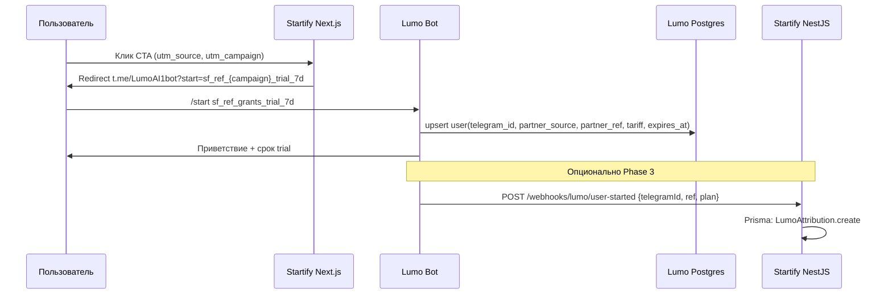
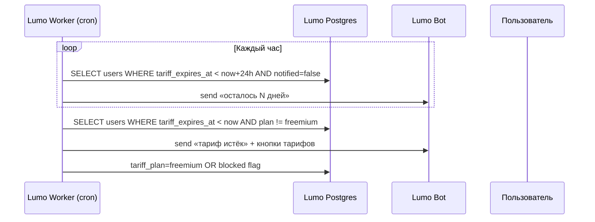
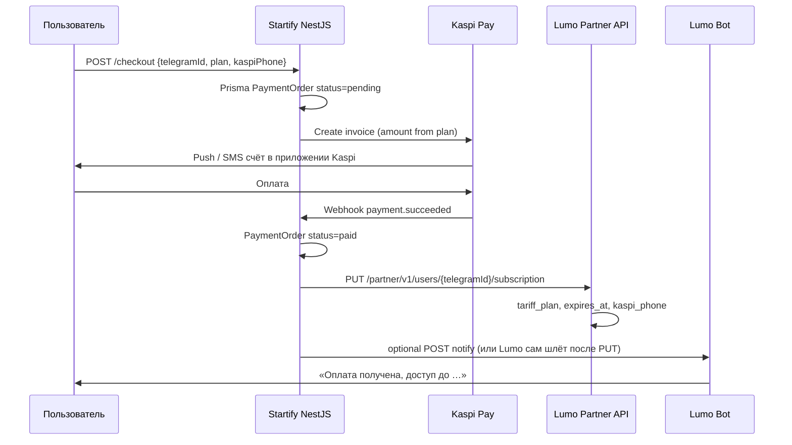

# Lumo ↔ AI Startify — спецификация интеграции (подписки + Kaspi)

Версия: 1.0 · Март 2026

Цель: пользователь приходит с сайта Startify (UTM) → получает тариф в Lumo → по истечении срока видит оффер → оплачивает через Kaspi → доступ открывается по `telegram_id`.

---

## 1. Потоки (sequence)

### 1.1 Переход с Startify в бота (UTM + сохранение)



**Сохраняем в Lumo (`users`):**

| Поле | Пример |
|------|--------|
| `telegram_id` | `5559703828` |
| `partner_source` | `startify` |
| `partner_ref` | `grants` (из UTM campaign) |
| `tariff_plan` | `trial_7d` или `freemium` |
| `tariff_expires_at` | `now + 7 days` для trial |

**Startify (Prisma)** дублирует для биллинга и аналитики — см. §3.

---

### 1.2 Обратный отсчёт и истечение тарифа



**Правила:**

- `trial_7d`, `plan_*` — при истечении `tariff_expires_at` доступ к безлимитному AI отключается (если `SUBSCRIPTIONS_ENFORCED=true`).
- `unlimited` — `tariff_expires_at = null`, не истекает.
- Уведомление **за 1 день** и **в день истечения**.

---

### 1.3 Выбор тарифа + телефон Kaspi (бот или сайт)

Два канала (достаточно одного):

**A. В боте (Lumo FSM — Phase 2):**

1. Inline-кнопки: 3 мес / 6 мес / 12 мес / Безлимит + цены.
2. Запрос: «Введите номер телефона Kaspi для выставления счёта».
3. Lumo вызывает Startify: `POST /api/billing/kaspi/create-invoice`.

**B. На сайте (Startify — рекомендуется для MVP):**

1. Telegram Login Widget → `telegram_id`.
2. Форма: тариф + телефон Kaspi.
3. NestJS создаёт счёт Kaspi.

---

### 1.4 Счёт Kaspi и подтверждение оплаты



---

## 2. Partner API Lumo (контракт для NestJS)

Base: `https://<lumo-railway>/api/partner/v1`  
Auth: `Authorization: Bearer <PARTNER_API_KEY>`

### GET `/health`

### GET `/users/{telegramId}`

Ответ:

```json
{
  "telegramId": 5559703828,
  "username": "user",
  "subscription": {
    "plan": "trial_7d",
    "planLabel": "Пробный 7 дней",
    "isActive": true,
    "isPaid": false,
    "expiresAt": "2026-07-07T12:00:00+00:00",
    "partnerSource": "startify",
    "partnerRef": "grants",
    "kaspiPhone": "+77001234567",
    "enforced": false,
    "aiDailyLimit": 999
  }
}
```

### PUT `/users/{telegramId}/subscription` — **главный вызов после оплаты**

```json
{
  "tariffPlan": "plan_6m",
  "kaspiPhone": "+77001234567",
  "partnerRef": "grants",
  "partnerSource": "startify",
  "expiresAt": "2026-12-30T15:00:00Z"
}
```

- `expiresAt` опционален — Lumo сам посчитает по `tariffPlan`.
- Допустимые `tariffPlan`: `freemium`, `trial_7d`, `plan_1m`, `plan_3m`, `plan_6m`, `plan_12m`, `unlimited`.

### POST `/users/{telegramId}/attribution`

```json
{ "partnerSource": "startify", "partnerRef": "landing_pricing" }
```

### GET `/catalog/opportunities?limit=50&offset=0`

Синк конкурсов на сайт Startify.

---

## 3. Prisma schema (Startify Postgres)

```prisma
generator client {
  provider = "prisma-client-js"
}

datasource db {
  provider = "postgresql"
  url      = env("DATABASE_URL")
}

enum TariffPlan {
  freemium
  trial_7d
  plan_1m
  plan_3m
  plan_6m
  plan_12m
  unlimited
}

enum PaymentStatus {
  pending
  invoice_sent
  paid
  failed
  expired
  refunded
}

model LumoUser {
  id              String    @id @default(cuid())
  telegramId      BigInt    @unique
  username        String?
  partnerSource   String?   @default("startify")
  partnerRef      String?   // utm_campaign
  utmSource       String?
  utmMedium       String?
  utmContent      String?
  currentPlan     TariffPlan @default(freemium)
  expiresAt       DateTime?
  kaspiPhone      String?
  createdAt       DateTime  @default(now())
  updatedAt       DateTime  @updatedAt
  orders          PaymentOrder[]
  attributions    AttributionEvent[]
}

model PaymentOrder {
  id              String        @id @default(cuid())
  lumoUserId      String
  lumoUser        LumoUser      @relation(fields: [lumoUserId], references: [id])
  telegramId      BigInt
  tariffPlan      TariffPlan
  amountKzt       Int
  kaspiPhone      String
  kaspiInvoiceId  String?
  status          PaymentStatus @default(pending)
  paidAt          DateTime?
  lumoSyncedAt    DateTime?     // успешный PUT subscription
  createdAt       DateTime      @default(now())
  updatedAt       DateTime      @updatedAt
  webhookEvents   KaspiWebhookEvent[]
}

model KaspiWebhookEvent {
  id              String        @id @default(cuid())
  orderId         String?
  order           PaymentOrder? @relation(fields: [orderId], references: [id])
  payload         Json
  processed       Boolean       @default(false)
  createdAt       DateTime      @default(now())
}

model AttributionEvent {
  id              String   @id @default(cuid())
  lumoUserId      String
  lumoUser        LumoUser @relation(fields: [lumoUserId], references: [id])
  partnerRef      String?
  utmSource       String?
  utmMedium       String?
  utmCampaign     String?
  deepLinkPayload String?
  createdAt       DateTime @default(now())
}
```

---

## 4. NestJS — модули

```
src/
  billing/
    billing.module.ts
    billing.controller.ts      # POST /checkout, GET /orders/:id
    billing.service.ts         # Kaspi client, Lumo sync
    kaspi.webhook.controller.ts
  lumo/
    lumo.module.ts
    lumo.client.ts             # HTTP client Partner API
  users/
    lumo-user.service.ts       # sync from webhook / Telegram Login
```

### `lumo.client.ts` (эскиз)

```typescript
@Injectable()
export class LumoPartnerClient {
  constructor(private http: HttpService) {}

  async activateSubscription(telegramId: bigint, body: {
    tariffPlan: string;
    kaspiPhone: string;
    partnerRef?: string;
  }) {
    const url = `${process.env.LUMO_PARTNER_API_URL}/users/${telegramId}/subscription`;
    const { data } = await firstValueFrom(
      this.http.put(url, body, {
        headers: { Authorization: `Bearer ${process.env.LUMO_PARTNER_API_KEY}` },
      }),
    );
    return data;
  }
}
```

### Checkout DTO

```typescript
export class CreateCheckoutDto {
  @IsNumber()
  telegramId: number;

  @IsEnum(TariffPlan)
  tariffPlan: TariffPlan;

  @Matches(/^\+7\d{10}$/)
  kaspiPhone: string;

  @IsOptional()
  partnerRef?: string;
}
```

---

## 5. Next.js — UTM → deep link

```typescript
// lib/lumo-deeplink.ts
const BOT = process.env.NEXT_PUBLIC_TELEGRAM_BOT_USERNAME ?? 'LumoAI1bot';

export function buildLumoStartLink(params: {
  utmCampaign: string;
  plan?: 'trial_7d' | 'plan_3m' | 'plan_6m' | 'plan_12m' | 'unlimited';
}) {
  const parts = ['sf', 'ref', params.utmCampaign];
  if (params.plan) parts.push(params.plan.replace('_', '')); // или полный id plan_3m
  const start = parts.join('_');
  return `https://t.me/${BOT}?start=${start}`;
}
```

Кнопка на лендинге:

```tsx
<Link href={buildLumoStartLink({ utmCampaign: 'grants', plan: 'trial_7d' })}>
  Открыть Lumo в Telegram — 7 дней бесплатно
</Link>
```

---

## 6. Тексты сообщений (RU)

### 6.1 После /start с trial (бот Lumo)

```
👋 Добро пожаловать в Lumo от AI Startify!

🎁 Вам активирован пробный доступ на 7 дней — без лимита AI-поиска и уведомлений по каналам.

⏳ Доступ до: {expires_at_local}

Настрой интерес: /set_interest
Добавь каналы: /add_channel
```

### 6.2 За 1 день до истечения

```
⏰ Завтра заканчивается ваш доступ к Lumo ({plan_label}).

Продлите подписку:
• 3 месяца — 4 990 ₸
• 6 месяцев — 7 990 ₸
• 12 месяцев — 11 880 ₸
• Безлимит — 49 000 ₸

👉 {checkout_url}
Или выберите тариф здесь: /subscribe
```

### 6.3 В день истечения

```
🔒 Пробный период Lumo завершён.

Чтобы снова получать подборки грантов и стажировок без лимита AI — выберите тариф.

Для выставления счёта в Kaspi укажите номер телефона, привязанный к Kaspi (формат +77001234567).

/subscribe
```

### 6.4 Запрос телефона Kaspi (бот или форма)

```
📱 Введите номер телефона Kaspi, на который выставить счёт.

Формат: +77001234567
Сумма по тарифу «{plan_label}»: {amount} ₸

После оплаты доступ откроется автоматически в течение нескольких минут.
```

### 6.5 Счёт создан (Startify → пользователь, SMS/push Kaspi + опционально бот)

```
✅ Счёт на {amount} ₸ выставлен в Kaspi на номер {kaspi_phone}.

Откройте приложение Kaspi → Уведомления → оплатите счёт «AI Startify — Lumo {plan_label}».

После оплаты бот Lumo пришлёт подтверждение.
```

### 6.6 Оплата подтверждена (после webhook → PUT Lumo)

```
🎉 Оплата получена!

Тариф: {plan_label}
Активен до: {expires_at} (или «навсегда» для Безлимит)

Спасибо, что пользуетесь Lumo × AI Startify!
```

---

## 7. Таблица цен для Kaspi

| plan id | Сумма (₸) | Назначение платежа (Kaspi description) |
|---------|-----------|----------------------------------------|
| plan_3m | 4990 | AI Startify — Lumo 3 месяца |
| plan_6m | 7990 | AI Startify — Lumo 6 месяцев |
| plan_12m | 11880 | AI Startify — Lumo 12 месяцев |
| unlimited | 49000 | AI Startify — Lumo Безлимит |

---

## 8. Webhook Startify ← Lumo (опционально, Phase 3)

Startify принимает:

`POST /api/webhooks/lumo/user-started`

```json
{
  "telegramId": 5559703828,
  "username": "name",
  "partnerRef": "grants",
  "tariffPlan": "trial_7d",
  "expiresAt": "2026-07-07T12:00:00Z"
}
```

Auth: `X-Lumo-Webhook-Secret` (отдельный секрет).

---

## 9. Чеклист запуска

### Startify

- [ ] Prisma migrate + seed планов
- [ ] Next.js: UTM landing + deep links
- [ ] Telegram Login Widget на checkout
- [ ] NestJS checkout + Kaspi invoice
- [ ] Kaspi webhook → idempotent activate
- [ ] `PUT` Lumo subscription после `paid`
- [ ] Retry при 5xx от Lumo (очередь)
- [ ] Admin: список заказов

### Lumo

- [ ] `PARTNER_API_KEY` совпадает с Startify
- [ ] Авто `trial_7d` при deep link `*_trial_7d`
- [ ] Cron expiry notifications
- [ ] `/subscribe` или Mini App checkout URL
- [ ] `SUBSCRIPTIONS_ENFORCED=true` в день запуска

---

## 10. Безопасность

- Partner API только server-to-server (Bearer), не светить ключ во frontend.
- Webhook Kaspi: проверка подписи + idempotency key.
- `telegram_id` из Telegram Login Widget — верифицировать hash (official algorithm).
- Не логировать полные номера телефонов в plain text (маскировать `+7700***4567`).

---

## Связанные файлы в репозитории Lumo

| Файл | Назначение |
|------|------------|
| `api/routes/partner.py` | Partner API |
| `services/subscription.py` | Тарифы, expires_at, deep link parser |
| `services/partner_attribution.py` | /start attribution |
| `db/models.py` | User.tariff_* |
| `docs/STARTIFY_API.md` | Краткий API reference |
